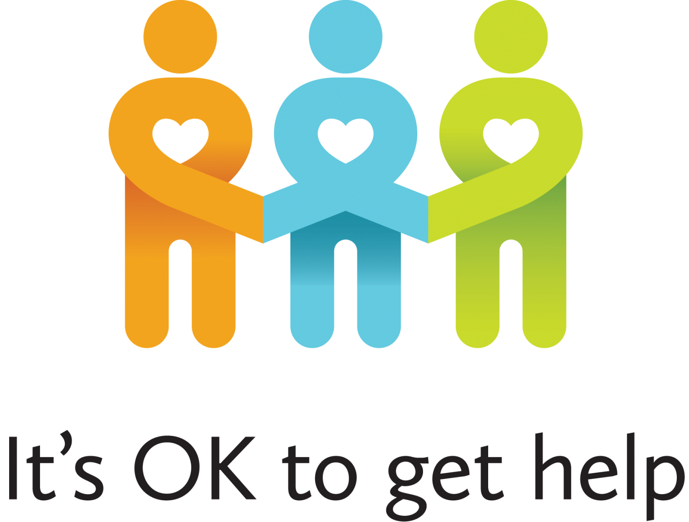

# INFO201AU-FINAL-PROJECT

## Group members: **April Zhao**, Benjamin Shi, Chenxi Di, Satvik Vats.

### Please check the following links to see more information about our project.

* [The first draft of final project proposal](project-proposal.rmd)
* [The dataset we used in the study](https://www.kaggle.com/osmi/mental-health-in-tech-2016/version/1)
* [The shiny web application on server]()
* [The conclusion of the study](demo/project_conclusion.md)
***
### The background of the study.

* “Love and work are the cornerstones of our humanness.” Sigmund Freud was one of the first to recognize the connection between work and mental health. However, the ubiquitous globlization triggers the world-wide "race to the bottom". Providing a health workplace loses it's significance.
* The study guides us to take a close look in the IT industry. Exploring potential correlation between different factors in the workplace and mental disorder.
***

### The dataset and about.

* The dataset used for this study is the work of [OSMI](https://osmihelp.org/). OSMI is a dedicated data source on mental illlness and disorder. Three survery were conducted on 2014, 2016 and 2017, focusing on the mental health in IT industry.
* The survey in 2016 is the most complete, diverse and reasonable dataset in all three surveys. It involves 1434 participants. Those participants were asked to answer up to 63 questions ranging from number of employees in the company to the age group.
* After productive discussion, we decide to use the dataset in 2016 and drop off other surveys. We do this for two reasons.
  + Frist, the 2014 contains too less questions to generate a meaningful conclusion with rest of datasets.
  + Second, the 2017 survey contains a "biased" dataset. Most of the participants identify themselves as white male. After researching on the real-life demographic in 2017, we reach out the conclusion that the different is statistical significance and not to include this survey in this study.
***

### Suggestion and conclusion.
* After thougtful analysis on the survey. We reach out following conclusions:
 + 

***
### Looking forward.

* Things you can do:
  - You can use following resource for information and help.
    - [National Alliance on Mental Illness](https://www.nami.org/stigmafreeco/resources)
    - [National Institution of Mental Health](https://www.nimh.nih.gov/health/find-help/index.shtml)
    - [The suicide pervention Lifeline](https://suicidepreventionlifeline.org/)
    - [Anxiety and Depression Association of America (ADAA)](https://adaa.org/)
    - [King county mental health support](https://www.kingcounty.gov/depts/community-human-services/mental-health-substance-abuse/services/mental-health.aspx)
  - Use social media to help spread awareness and advocate for social change.
  - Know your rights.
    - [Brief Introduction to rights as an employee](https://employment.findlaw.com/employment-discrimination/employees-rights-101.html)
  - Live in a health and active lifestyle.
